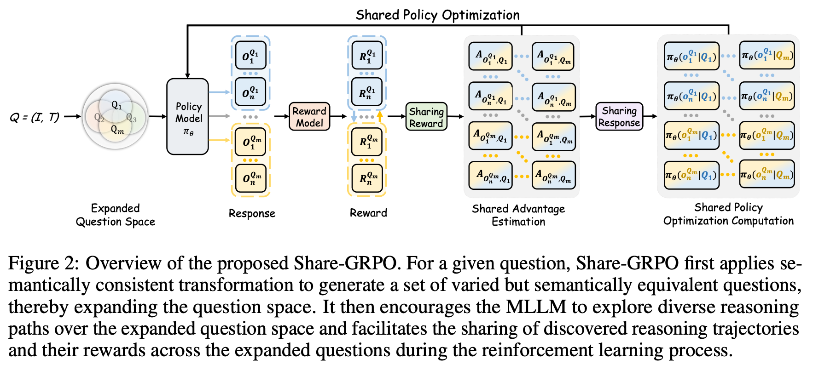

<div align="center">

<h1> R1-ShareVL: Incentivizing Reasoning Capability of Multimodal Large Language Models via Share-GRPO </h1>

<h5 align="center"> If you find this project useful, please give us a star🌟.

<h5 align="center"> 

<a href='https://arxiv.org/abs/2505.16673'></a>
<a href='https://huggingface.co/HuanjinYao/R1-ShareVL-7B'>
<a href='https://huggingface.co/datasets/HuanjinYao/R1-ShareVL-52K'>
<!--<a href='https://huggingface.co/collections/HuanjinYao/denseconnector-66500e173fc8c9f05dc98dea'></a>
[](https://zhuanlan.zhihu.com/p/700000183)
<a href='https://huggingface.co/spaces/HuanjinYao/DenseConnector-v1.5-8B'></a>-->


[Huanjin Yao](https://scholar.google.com/citations?user=pDtsCBQAAAAJ&hl=zh-CN)<sup>2,3*</sup>,
[Qixiang Yin](https://jxhuang0508.github.io/)<sup>4*</sup>,
[Jingyi Zhang]()<sup>1</sup>,
[Min Yang]()<sup>2</sup>,
[Yibo Wang]()<sup>3</sup>,
[Wenhao Wu]()<sup>5</sup>,

[Fei Su]()<sup>4</sup>,
[Li Shen]()<sup>1</sup>,
[Minghui Qiu]()<sup>2</sup>,
[Dacheng Tao]()<sup>1</sup>
[Jiaxing Huang](https://jxhuang0508.github.io)<sup>1✉️</sup>


<sup>1</sup>[Nanyang Technological University](https://www.ntu.edu.sg/), <sup>2</sup>[ByteDance](), <sup>3</sup>[Tsinghua University](https://www.tsinghua.edu.cn/en/), <sup>4</sup>[BUPT](), <sup>5</sup>[USYD](https://www.sysu.edu.cn/sysuen/)

<sup>*</sup>Equal Contribution,       <sup>✉️</sup>Corresponding Author

</h5>
</div>


## 🎙️ News
- [x] **`Sep 19, 2025.`** **R1-Share** has been accepted at NeurIPS 2025!
- [x] **`Jul 15, 2025.`** We release our [ShareGRPO Training code](), [52K Training Data](https://huggingface.co/datasets/HuanjinYao/R1-ShareVL-52K) and [R1-ShareVL-7B Model](https://huggingface.co/HuanjinYao/R1-ShareVL-7B)!
- [x] **`May 23, 2025.`** We release our paper in [arxiv](https://arxiv.org/abs/2505.16673).


## 💡 About R1-ShareVL
We introduce Share-GRPO, a novel reinforcement learning framework for MLLMs that addresses the challenges of sparse rewards and advantage vanishing in reasoning tasks. For a given question, Share-GRPO first applies semantically consistent transformations to generate a set of varied but semantically equivalent questions, thereby expanding the question space. It then encourages the MLLM to explore diverse reasoning paths across this expanded space and facilitates the sharing of discovered reasoning trajectories and their rewards among these question variants during the reinforcement learning process. This approach enables more effective exploration, denser reward signals, and more robust training. 

<div align=center>

</div>

## 🚀 Training


### Installation
```bash
git clone https://github.com/HJYao00/R1-ShareVL.git
cd R1-ShareVL
pip install -e .
```

### GRPO Training

```bash
bash examples/qwen2_5_vl_7b_sharegrpo.sh
```

### Merge Checkpoint in Hugging Face Format

```bash
python3 scripts/model_merger.py --local_dir checkpoints/easy_r1/exp_name/global_step_1/actor
```

## 🚗 Evaluation
We evaluate R1-ShareVL using [VLMEvalKit](https://github.com/open-compass/VLMEvalKit)! Please make sure to include a thinking prompt after the question [here](https://github.com/open-compass/VLMEvalKit/blob/main/vlmeval/vlm/qwen2_vl/model.py#L342).

```bash
R1_PROMPT = r"""You FIRST think about the reasoning process as an internal monologue and then provide the final answer.
 The reasoning process MUST BE enclosed within <think> </think> tags. The final answer MUST BE put in \boxed{}."""

item = {'type': 'text', 'text': s['value'] + " " + R1_PROMPT}
```

## 🔗 Citation
If you find this repository is useful, please star🌟 this repo and cite🖇️ our paper.
```bibtex
@misc{yao2025r1sharevl,
      title={R1-ShareVL: Incentivizing Reasoning Capability of Multimodal Large Language Models via Share-GRPO}, 
      author={Huanjin Yao and Qixiang Yin and Jingyi Zhang and Min Yang and Yibo Wang and Wenhao Wu and Fei Su and Li Shen and Minghui Qiu and Dacheng Tao and Jiaxing Huang},
      year={2025},
      eprint={2505.16673},
      archivePrefix={arXiv},
      primaryClass={cs.CV},
}
```

## 🙏 Acknowledgment
Our work is primarily based on the following codebases. We are sincerely grateful for their work.
- [EasyR1](https://github.com/hiyouga/EasyR1): We use EasyR1 to fine-tune R1-ShareVL Models.
- [VLMEvalKit](https://github.com/open-compass/VLMEvalKit): We use VLMEvalKit for evaluation.
